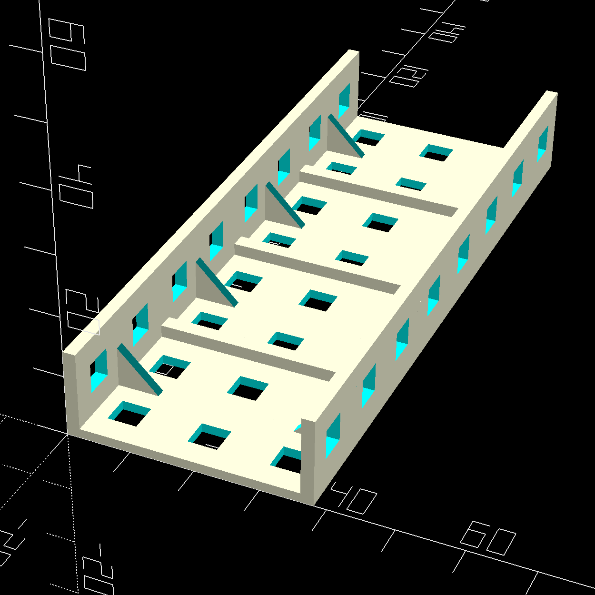
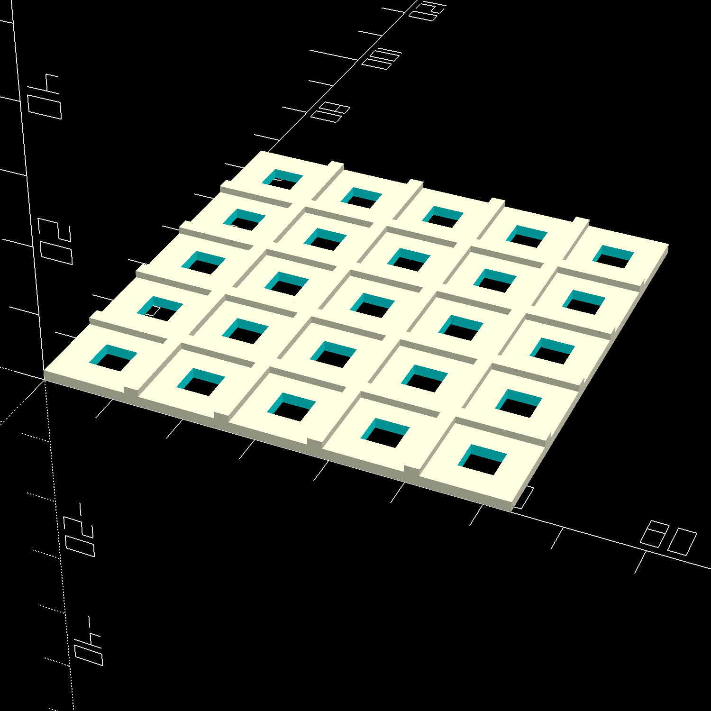
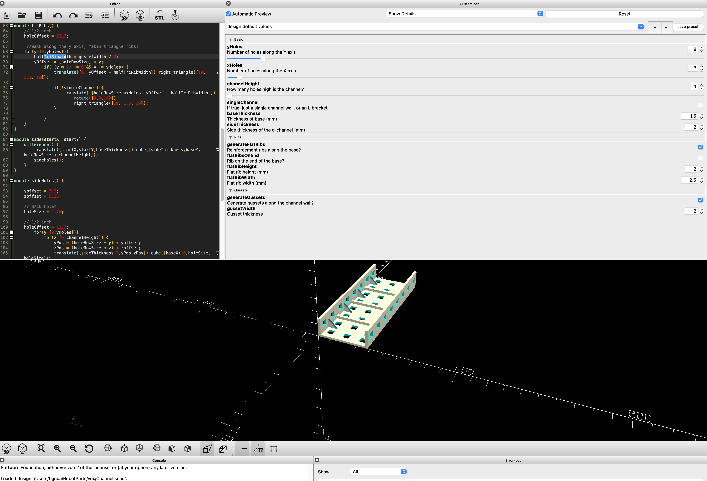

# Parametric 3d printable parts for Vex robots 

### The team developed a couple of handy parts that you can print to save weight or customize for a perfect fit on your robot.

## Channel

## Plate

## How to use

### Download and install [OpenScad](https://openscad.org/)

### Download and install the [Belfry OpenScad Library](https://github.com/revarbat/BOSL) according to the directions found in the repository

### Open up `Channel.scad` or `DiamondPlate.scad` and use the customizer to tailor the part to your needs

